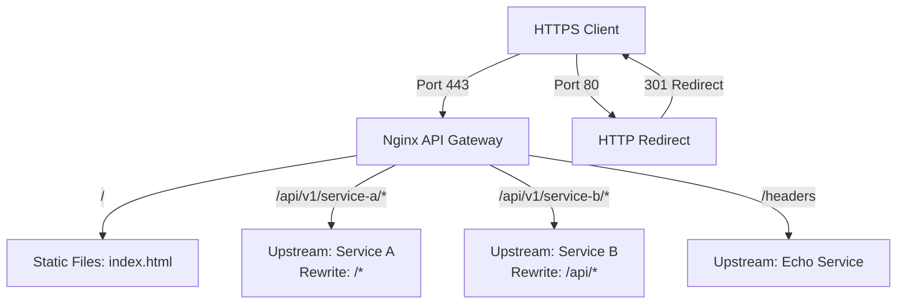

# Nginx API Gateway & Certificate Generator

This project contains two components:
1. **Google Student Ambassador Certificate Generator (Music Night Edition)**: A high-performance, browser-based, client-side application that generates and customizes certificates dynamically. Hosted live on Vercel.
2. **Nginx API Gateway**: A local reverse proxy and load balancer configuration demonstrating advanced features like SSL termination, path rewriting, header modifications, rate limiting, and custom JSON logging.

---

## 🚀 Live Web App (Vercel)

The frontend certificate generator is deployed and live at:
👉 **[https://cert-gen-eta-seven.vercel.app](https://cert-gen-eta-seven.vercel.app)**

---

## 🛠️ API Gateway Architecture

The Gateway architecture routes traffic securely based on request paths:



### Key Gateway Features
- **SSL/TLS Termination**: Configured with modern ciphers, session caching, and automated HTTP-to-HTTPS redirect.
- **Dynamic Path Rewrites**:
  - `/api/v1/service-a/info` rewrites to `/info` and forwards to Service A.
  - `/api/v1/service-b/status` rewrites to `/api/status` and forwards to Service B.
- **Rate Limiting**: Configured using a shared memory zone (`api_limit`) limited to **10 requests per second** per IP with a burst allowance of **5**. Returns a clean JSON payload upon rate limit exhaustion (`429 Too Many Requests`).
- **Header Modification & Tracing**: Injects downstream security headers (`X-Frame-Options`, `Content-Security-Policy`, etc.) and a unique `X-Request-ID` correlation identifier per request for end-to-end logging/tracing.
- **JSON Structured Logging**: Configured access logs in JSON format for easy parsing by monitoring agents (like Promtail/Elasticsearch).

---

## 💻 Local Run Guide (Docker Compose)

### Prerequisites
- [Docker](https://www.docker.com/) and [Docker Compose](https://docs.docker.com/compose/)

### Running the Gateway

1. In this directory, start the services:
   ```bash
   docker compose up -d
   ```
2. Verify all containers are running:
   ```bash
   docker compose ps
   ```

### Verification & Testing

#### 1. Test SSL Termination & HTTP-to-HTTPS Redirect
Send an HTTP request to see the automatic redirect:
```bash
curl -i http://localhost/
```
*(You should see an HTTP/1.1 301 Moved Permanently response pointing to `https://localhost/`)*

Send an HTTPS request (ignoring self-signed warning with `-k`):
```bash
curl -k -i https://localhost/
```

#### 2. Test Path Routing & Rewriting
Request Service A:
```bash
curl -k https://localhost/api/v1/service-a/hello
```
*(Returns: `Hello from Service A (Target /)`)*

Request Service B:
```bash
curl -k https://localhost/api/v1/service-b/hello
```
*(Returns: `Hello from Service B (Target /api)`)*

#### 3. Test Header Modification & Request ID
Request the Echo endpoint to see the headers forwarded by Nginx:
```bash
curl -k https://localhost/headers
```
*(You will see `x-request-id`, `x-real-ip`, `x-forwarded-for`, and `x-forwarded-proto` headers added by the gateway)*

#### 4. Test Rate Limiting (429 JSON Error)
Send a burst of requests to trigger the rate limiter:
```bash
for i in {1..20}; do curl -k -s -o /dev/null -w "%{http_code}\n" https://localhost/api/v1/service-a/hello; done
```
*(You should see some `200` responses followed by `429` responses with the custom JSON error payload)*
